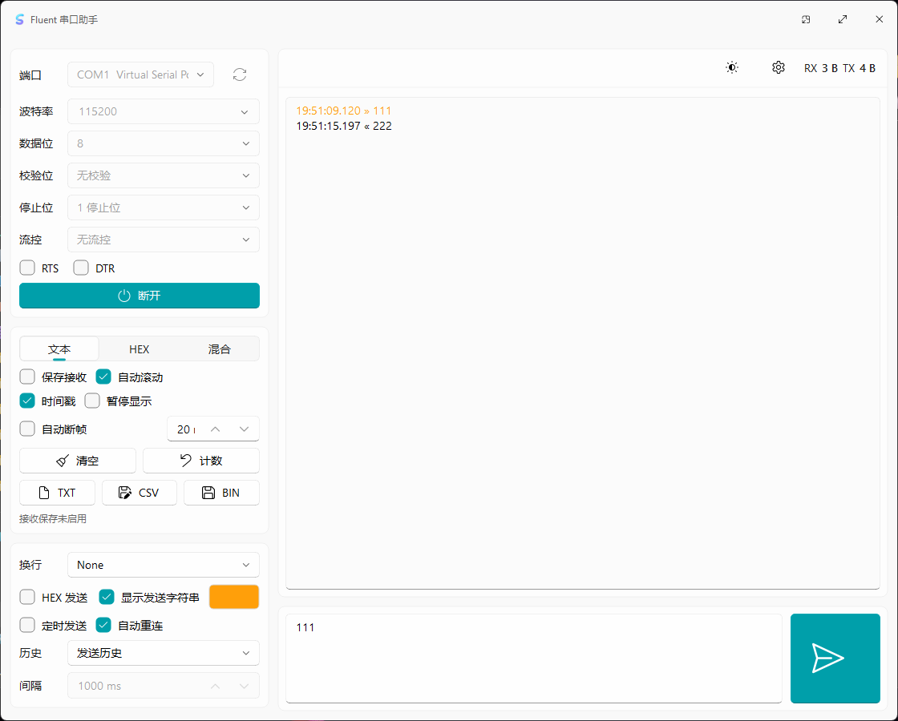

<div align="center">
  
  <h1>Fluent 串口助手</h1>
  <p>基于 C++17、Qt 6 Widgets 和 FluentQtWidgets 的现代串口调试工具。</p>
  <p>
    <a href="LICENSE">GPL-3.0-or-later</a>
    ·
    <a href=".github/workflows/ci.yml">三平台 CI</a>
    ·
    <a href="CONTRIBUTING.md">贡献指南</a>
  </p>
</div>

Fluent 串口助手是一个基于 C++17、Qt 6 Widgets 和 FluentQtWidgets 的跨平台串口调试工具。项目目标是提供一个现代 Fluent 风格的串口终端，覆盖常用串口连接、收发、显示、导出和主题配置工作流。

当前版本仍处于早期开发阶段，功能以“终端工作台”和“设置”为主。

## 界面截图

<p align="center">
  
</p>

## 功能特性

- 串口扫描：显示端口名、描述、厂商、VID/PID 和序列号。
- 连接参数：支持常用和扩展波特率、数据位、校验位、停止位、流控、RTS、DTR。
- 终端显示：支持文本、HEX、混合显示模式。
- 编码支持：接收和文本发送可分别选择 UTF-8、GBK、ASCII、Latin1。
- 自动断帧：支持按接收间隔、帧头、帧尾和固定长度断帧。
- 记录显示：RX/TX 统一会话记录，支持暂停显示、自动滚动、清空和计数重置。
- 终端检索：支持按关键字搜索、高亮匹配、上/下匹配跳转、大小写敏感、正则搜索，并按全部、接收、发送过滤当前显示。
- 状态统计：显示 RX/TX 总量、实时速率和连接时长。
- TX 着色：可选择发送记录显示颜色。
- 数据发送：支持文本和 HEX 发送，支持 None、CR、LF、CRLF 行结束符。
- 校验工具：支持 CRC16-Modbus、CRC16-CCITT、CRC32、LRC、XOR、SUM8 手动计算和发送时自动追加。
- Modbus RTU：支持常用读写请求帧生成、CRC 自动追加、直接发送和响应摘要解析。
- 左侧卡片：连接、接收、发送、Modbus、常用包、宏命令和文件发送卡片可折叠，并记住折叠状态。
- 发送历史：保留最近 20 条唯一发送记录。
- 常用包：支持分组、备注、启用/停用、保存、载入、发送、批量发送、删除、排序和 JSON 导入导出。
- 宏命令：支持多步骤发送、步骤间延时、等待文本/HEX 响应、循环运行、失败中止和 CSV 结果导出。
- 循环发送：支持毫秒级发送间隔。
- 文件发送：支持选择文件后按块发送，可配置块大小和块间隔，并显示进度。
- 应用更新：可检查 GitHub Releases 中的最新应用版本。
- 导出记录：支持 TXT、CSV、BIN。
- 接收保存：可将接收原始数据保存到文件。
- 会话恢复：恢复上次串口参数、发送输入、常用包、宏命令和文件发送参数，可选启动后自动连接。
- 外观设置：支持浅色、深色、跟随系统主题和主题色配置。
- 字体设置：支持界面字体、终端等宽字体、终端字号和 TTF/OTF/TTC 自定义字体导入。

## 预览状态

已完成：

- 终端工作台
- 设置页
- Windows 紧凑发布包脚本
- GitHub Actions 三平台构建 CI
- GitHub Releases 三平台发布资产

暂未开放：

- 快速绘图
- 宏命令
- 测试序列
- 插件系统

## 后续规划

后续功能增强需求见 [功能需求规划](docs/feature-roadmap.md)。

## 技术栈

- C++17
- Qt 6.5+
- Qt Widgets
- Qt SerialPort
- Qt Svg
- FluentQtWidgets
- CMake
- Ninja

## 目录结构

```text
.
├── .github/workflows/        # GitHub Actions CI
├── docs/images/              # README 截图和文档图片
├── scripts/                  # 发布和辅助脚本
├── src/
│   ├── app/core/             # 字体偏好、HEX 解析、更新检查等通用逻辑
│   ├── app/resources/        # Qt 资源、应用图标和平台资源
│   ├── app/serial/           # QSerialPort 封装
│   └── app/view/             # 主窗口、设置页和终端工作台
│       └── workbench/        # 终端工作台按职责拆分的实现文件
│           ├── *_layout.cpp              # 页面整体布局
│           ├── *_side_sections.cpp       # 左侧连接、收发、常用包、宏命令、文件发送配置
│           ├── *_terminal_sections.cpp   # 终端区和发送区 UI
│           ├── *_terminal.cpp            # 终端记录、过滤、分色和渲染
│           ├── *_packets.cpp             # 发送历史和常用包
│           ├── *_macros.cpp              # 宏命令和测试序列
│           ├── *_files.cpp               # 记录导出、接收保存和文件发送
│           ├── *_connection.cpp          # 连接、重连和控件启停
│           └── *_state.cpp               # 设置恢复、保存、计数和状态更新
├── third_party/FluentQtWidgets/
├── CMakeLists.txt
├── CMakePresets.json
└── README.md
```

## 获取源码

项目使用 `FluentQtWidgets` 作为 Git 子模块：

```powershell
git clone --recursive <repo-url>
cd FluentSerialAssistant
```

如果已经克隆但没有拉取子模块：

```powershell
git submodule update --init --recursive
```

## 本地构建

### 环境要求

- CMake 3.21+
- Ninja
- Qt 6.5+，需要包含 `SerialPort`、`Svg` 和 `Core5Compat` 模块
- Windows 本地预设默认使用：
  - Qt：`C:/Qt/6.11.1/mingw_64`
  - MinGW：`C:/Qt/Tools/mingw1310_64`

### Debug

```powershell
cmake --preset mingw-debug
cmake --build --preset mingw-debug --parallel
```

运行：

```powershell
.\build\mingw-debug\FluentSerialAssistant.exe
```

### Release

```powershell
cmake --preset mingw-release
cmake --build --preset mingw-release --parallel
```

如果链接时报 `cannot open output file FluentSerialAssistant.exe: Permission denied`，通常是旧程序仍在运行，请关闭后重新构建。

### VS Code 一键构建

仓库内置 `.vscode/tasks.json`，在 VS Code 中打开项目后可直接使用：

- `Ctrl+Shift+B` / `Cmd+Shift+B`：执行默认 Debug 构建任务。
- `Terminal > Run Build Task...`：选择 Debug 或 Release 构建任务。
- `Run and Debug > Debug FluentSerialAssistant` 或 `F5`：构建 Debug 版本并启动调试。

Windows 下任务复用 `CMakePresets.json` 中的 MinGW 预设；macOS 和 Linux 下任务使用 `build/vscode-debug` 或 `build/vscode-release` 目录执行 Ninja 构建。

## 打包发布

Windows 紧凑发布包：

```powershell
.\scripts\package_release.ps1
```

输出目录：

```text
dist/FluentSerialAssistant-release
```

脚本会执行：

- MinSizeRel 构建
- `windeployqt` 部署 Qt 依赖
- 排除未使用的插件、翻译和软件 OpenGL fallback
- 对 `.exe` 和 `.dll` 执行 `strip --strip-unneeded`

## 使用说明

1. 选择串口端口，必要时点击刷新。
2. 配置波特率、数据位、校验位、停止位、流控。
3. 点击连接。
4. 在终端记录区查看 RX/TX。
5. 在发送区输入文本或 HEX 数据，必要时选择收发编码、行结束符和校验自动追加后发送。
6. 可在常用包中填写分组、名称、备注、内容、模式和换行后保存，之后选中条目即可填入发送区、直接发送、批量发送或 JSON 导入导出。
7. 可在宏命令中保存多步骤测试序列，配置延时、期望响应、循环次数和失败中止后运行，并导出 CSV 结果。
8. 可选择文件，配置块大小和间隔后分块发送。
9. 可点击左侧卡片标题折叠不常用配置，减少侧栏占用。
10. 可开启自动断帧、时间戳、自动滚动、循环发送等选项。
11. 使用 TXT、CSV、BIN 导出会话记录。

## 许可证

本项目采用 GNU General Public License v3.0 or later，详见 [LICENSE](LICENSE)。

由于本项目依赖的 `FluentQtWidgets` 也采用 GPL-3.0-or-later，分发本项目或其派生版本时需要遵守 GPL 的源代码开放和再分发要求。

## 相关项目

- [FluentQtWidgets](https://github.com/txp666/FluentQtWidgets)
