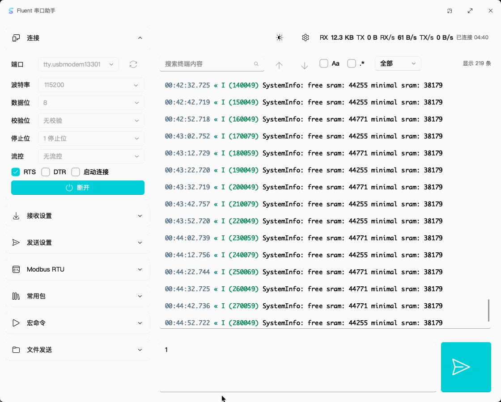

<div align="center">
  
  <h1>Fluent Serial Assistant</h1>
  <p>A modern serial-port debugging tool built with C++17, Qt 6 Widgets, and FluentQtWidgets.</p>
  <p>English · <a href="README.md">简体中文</a></p>
  <p>
    <a href="LICENSE">GPL-3.0-or-later</a>
    ·
    <a href="https://github.com/txp666/FluentSerialAssistant/releases">Downloads</a>
    ·
    <a href=".github/workflows/ci.yml">Cross-platform CI</a>
    ·
    <a href="CODE_SIGNING_POLICY.md">Code signing policy</a>
    ·
    <a href="CONTRIBUTING.md">Contributing</a>
  </p>
</div>

Fluent Serial Assistant is a cross-platform serial terminal and protocol debugging application. It provides a modern Fluent-style workspace for serial connections, traffic inspection, packet construction, data visualization, automation, exporting, and appearance configuration.

The current release focuses on a multi-tab terminal workspace, automatic logging, quick plotting, a frame table, JavaScript automation, protocol templates, and application settings.

## Screenshot

<p align="center">
  
</p>

## Features

- Serial-port discovery with port name, description, vendor, VID/PID, and serial number.
- Common and extended baud rates, data bits, parity, stop bits, flow control, RTS, and DTR.
- Text, hexadecimal, and mixed terminal display modes.
- Independent UTF-8, GBK, ASCII, and Latin-1 encoding options for receiving and sending text.
- Frame splitting by receive interval, header, trailer, or fixed length.
- Protocol templates for headers, length fields, commands, payloads, and checksums.
- Unified RX/TX records with pause, automatic scrolling, clearing, and counter reset.
- Keyword, regular-expression, case-sensitive, direction-filtered terminal search.
- Multi-channel real-time plotting from numbers, delimited values, key-value pairs, or JSON objects, with CSV export.
- A sortable and filterable frame table with HEX/text copying and terminal navigation.
- Multiple independent serial sessions in tabs.
- RX/TX totals, live transfer rates, and connection duration.
- Text and HEX sending with None, CR, LF, and CRLF line endings.
- CRC16-Modbus, CRC16-CCITT, CRC32, LRC, XOR, and SUM8 calculation and automatic appending.
- Modbus RTU request generation, CRC appending, direct transmission, and response summaries.
- Collapsible connection, receive, protocol, send, Modbus, packet, macro, script, auto-reply, and file sections.
- Send history and reusable grouped packets with JSON import/export and batch sending.
- Multi-step macros with delays, expected responses, loops, stop-on-failure behavior, and CSV result export.
- A built-in JavaScript runner with controlled `serial.sendText()`, `serial.sendHex()`, `serial.records()`, and `serial.log()` APIs.
- AI control through a user-scoped local IPC service, a machine-readable CLI, and a stdio MCP server. AI clients can reuse the active GUI session for discovery, connection, traffic, protocol selection, records, and live-plot control without competing for the serial port.
- Text, HEX, and regular-expression auto-reply rules with configurable delays.
- Timed loop transmission and chunked file sending.
- Rolling TXT, CSV, and BIN automatic logs.
- GitHub Releases update checking.
- TXT, CSV, and BIN record export and raw receive-data saving.
- Session restoration and optional automatic reconnection.
- Light, dark, system theme, accent color, UI font, monospace font, and custom font configuration.
- Simplified Chinese and English interfaces with runtime language switching.
- User configuration stored in the standard per-user configuration directory on Windows, macOS, and Linux. Legacy configuration files from the application directory are migrated automatically.

## Technology

- C++17
- Qt 6.5+
- Qt Widgets, SerialPort, SVG, QML, and Core5Compat
- FluentQtWidgets
- CMake and Ninja

## Repository layout

```text
.
├── .github/workflows/        # GitHub Actions CI and release workflows
├── docs/                     # Images, release notes, and signing documentation
├── packaging/windows/        # Inno Setup definition and translations
├── scripts/                  # Packaging and helper scripts
├── signing/signpath/         # SignPath artifact configurations
├── src/
│   ├── app/core/             # Shared settings, fonts, parsing, and update logic
│   ├── app/control/          # Session control boundary, local JSON IPC, and client transport
│   ├── app/resources/        # Qt resources, icons, and platform metadata
│   ├── app/serial/           # QSerialPort integration
│   ├── app/view/             # Main window, settings, and terminal workspace
│   ├── cli/                  # Machine-readable CLI
│   └── mcp/                  # MCP stdio tool server
├── third_party/FluentQtWidgets/
├── CMakeLists.txt
└── CMakePresets.json
```

## Getting the source

The project uses `FluentQtWidgets` as a Git submodule:

```powershell
git clone --recursive <repo-url>
cd FluentSerialAssistant
```

For an existing clone without submodules:

```powershell
git submodule update --init --recursive
```

## Local build

### Requirements

- CMake 3.21+
- Ninja
- Qt 6.5+ with `SerialPort`, `Svg`, `Core5Compat`, and `Qml`
- The Windows presets expect:
  - Qt: `C:/Qt/6.11.1/mingw_64`
  - MinGW: `C:/Qt/Tools/mingw1310_64`

### Debug

```powershell
cmake --preset mingw-debug
cmake --build --preset mingw-debug --parallel
```

Run the application:

```powershell
.\build\mingw-debug\FluentSerialAssistant.exe
```

### Release

```powershell
cmake --preset mingw-release
cmake --build --preset mingw-release --parallel
```

If the linker reports `cannot open output file FluentSerialAssistant.exe: Permission denied`, close any running copy of the application and build again.

### VS Code

The repository includes `.vscode/tasks.json`:

- `Ctrl+Shift+B` / `Cmd+Shift+B` runs the default Debug build.
- `Terminal > Run Build Task...` lets you choose Debug or Release.
- `Run and Debug > Debug FluentSerialAssistant` or `F5` builds and starts a Debug session.

Windows tasks reuse the MinGW presets in `CMakePresets.json`. macOS and Linux tasks use Ninja build directories under `build/vscode-debug` or `build/vscode-release`.

## Packaging and releases

Pushing a `vX.Y.Z` tag that matches the CMake project version builds and publishes:

- Windows x64: an administrator-elevated Inno Setup installer that defaults to Program Files:
  `FluentSerialAssistant-X.Y.Z-windows-x64-setup.exe`
- macOS arm64: `FluentSerialAssistant-X.Y.Z-macos-arm64.dmg`
- Linux x64 and arm64 Debian packages:
  `FluentSerialAssistant-X.Y.Z-linux-{x64,arm64}.deb`
- A matching `.sha256` checksum for every package.

Windows releases support free open-source Authenticode signing through SignPath Foundation. The workflow signs `FluentSerialAssistant.exe`, builds the Inno Setup installer, and then signs the installer. See the [SignPath setup guide](docs/signing/SIGNPATH_SETUP.md).

The lower-level packaging scripts are `scripts/package_windows.ps1`, `scripts/package_unix.sh`, and `scripts/create_deb_package.sh`.

## Basic usage

1. Select a serial port and refresh the port list when necessary.
2. Configure baud rate, data bits, parity, stop bits, and flow control.
3. Connect and inspect RX/TX traffic in the terminal.
4. Send text or HEX data with the required encoding, line ending, and checksum.
5. Save reusable packets, macros, protocol templates, scripts, and auto-reply rules.
6. Use quick plotting or the frame table to inspect structured incoming data.
7. Export records as TXT, CSV, or BIN.

## AI, CLI, and MCP control

Once the GUI is running, `fluentserial-cli` and `fluentserial-mcp` can control its current serial session. The GUI remains the sole owner of each serial port; both adapters reuse its protocol parsing, records, and live plotting over a user-scoped local IPC channel.

```bash
fluentserial-cli ports
fluentserial-cli status
fluentserial-cli send-hex --hex "01 03 00 00 00 02 C4 0B"
fluentserial-cli records --direction rx --limit 20
fluentserial-cli plot --plot-protocol keyValue
```

See [AI control, CLI, MCP, and IPC documentation](docs/ai-control.md) for architecture, client configuration, all tools, and the versioned IPC contract.

Business settings use Qt `QSettings::IniFormat`. On every supported platform, business and Fluent appearance settings are stored together in Qt's standard per-user configuration directory. The first run migrates legacy settings found next to the executable.

## License

This project is licensed under the GNU General Public License v3.0 or later. See [LICENSE](LICENSE).

`FluentQtWidgets` is also distributed under GPL-3.0-or-later, so redistribution of this project or a derivative must comply with the corresponding source-code and redistribution requirements.

## Related project

- [FluentQtWidgets](https://github.com/txp666/FluentQtWidgets)

## Code signing policy

Free code signing is provided by [SignPath.io](https://signpath.io/), with a certificate from [SignPath Foundation](https://signpath.org/), after the project's open-source application is approved. Team roles, release controls, signed artifact scope, and privacy details are documented in the [code signing policy](CODE_SIGNING_POLICY.md) and [privacy policy](PRIVACY.md).
