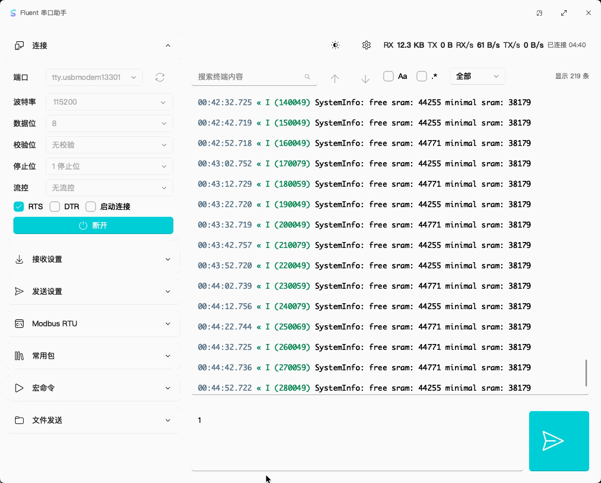

<div align="center">
  
  <h1>Fluent Serial Assistant</h1>
  <p>A modern serial-port debugging tool built with C++17, Qt 6 Widgets, and FluentQtWidgets.</p>
  <p>English · <a href="README.md">简体中文</a></p>
  <p>
    <a href="LICENSE">GPL-3.0-or-later</a>
    ·
    <a href="https://github.com/txp666/FluentSerialAssistant/releases">Downloads</a>
    ·
    <a href=".github/workflows/release.yml">Cross-platform release builds</a>
    ·
    <a href="CODE_SIGNING_POLICY.md">Code signing policy</a>
    ·
    <a href="CONTRIBUTING.md">Contributing</a>
  </p>
</div>

Fluent Serial Assistant is a cross-platform serial terminal and protocol debugging application. It provides a modern Fluent-style workspace for serial connections, traffic inspection, packet construction, data visualization, automation, exporting, and appearance configuration.

The current version is **v0.1.17**, using **FluentQtWidgets v0.1.9**. Features include a multi-tab terminal workspace, automatic logging, independent plot windows, a frame table, JavaScript automation, a visual protocol-template editor, and application settings.

## Screenshot

<p align="center">
  
</p>

## Features

- Serial-port discovery with port name, description, vendor, VID/PID, and serial number.
- Common and extended baud rates, data bits, parity, stop bits, flow control, RTS, and DTR.
- Text, hexadecimal, and mixed terminal display modes.
- Independent UTF-8, GBK, ASCII, and Latin-1 encoding options for receiving and sending text.
- Frame splitting by receive interval, header, trailer, or fixed length.
- A separate visual frame-protocol editor for headers, length fields, commands, payloads, and checksums. Enter a HEX sample or use the latest received frame to inspect colored byte regions, field positions, parsed values, and checksum results. Templates and sample frames can be saved and selected later.
- Unified RX/TX records with pause, automatic scrolling, clearing, and counter reset.
- Keyword, regular-expression, case-sensitive, direction-filtered terminal search.
- Terminal colors in Settings: toggle ESP-IDF, common log levels, success/failure, or AT response presets, or define keyword/regex colors with case sensitivity, matched-text or whole-line scope, and rule priority. Settings persist and apply to all terminal sessions.
- Independent plot windows: every click on the plot icon asks you to select a protocol before creating another window. Supported parsers include line-aware numbers, delimited values, multi-word/Unicode key-value pairs, nested JSON, and binary fields. Preview text/HEX samples, select fields, and configure integer/float types, byte offsets, byte order, scaling, and value offsets for complete frames or the payload of a selected frame template. Pause, clear, and CSV export are available. Windows collect only new RX records while open; hiding, minimizing, or closing stops parsing and rendering, with no historical backfill.
- A sortable and filterable frame table with HEX/text copying and terminal navigation.
- Multiple independent serial sessions in tabs.
- A built-in virtual serial pair: enable it in Settings, then connect two sessions to `VIRTUAL-A` and `VIRTUAL-B` for two-way data transfer inside the app without installing drivers.
- RX/TX totals, live transfer rates, and connection duration.
- A broom button at the far left of the terminal toolbar clears the terminal display and resets RX/TX traffic counters together.
- Text and HEX sending with None, CR, LF, and CRLF line endings.
- CRC16-Modbus, CRC16-CCITT, CRC32, LRC, XOR, and SUM8 calculation and automatic appending.
- Modbus RTU request generation, CRC appending, direct transmission, and response summaries.
- Collapsible connection, receive, protocol, send, Modbus, packet, macro, script, auto-reply, and file sections.
- Send history and reusable grouped packets with JSON import/export and batch sending.
- Multi-step macros with delays, expected responses, loops, stop-on-failure behavior, and CSV result export.
- A built-in JavaScript runner with controlled `serial.sendText()`, `serial.sendHex()`, `serial.records()`, and `serial.log()` APIs.
- AI control through a user-scoped local IPC service, a machine-readable CLI, and a stdio MCP server. AI clients can reuse the active GUI session for discovery, connection, traffic, protocol selection, records, and live-plot control without competing for the serial port.
- Multiple text, HEX, and regular-expression auto-reply rules with configurable delays. Click **New**, fill in the rule, then **Add**; select an existing rule and click **Save** to edit it.
- Timed loop transmission and chunked file sending.
- Rolling TXT, CSV, and BIN automatic logs.
- Automatic update checks at startup, release notes before confirmation, and download, verification, and installation after approval. Manual checks and retries are available in Settings.
- TXT, CSV, and BIN record export and raw receive-data saving.
- Session restoration and optional automatic reconnection.
- Light, dark, system theme, accent color, UI font, monospace font, and custom font configuration.
- Simplified Chinese and English interfaces with runtime language switching.
- User configuration stored in the standard per-user configuration directory on Windows, macOS, and Linux. Legacy configuration files from the application directory are migrated automatically.

## Technology

- C++17
- Qt 6.5+
- Qt Widgets, SerialPort, SVG, QML, and Core5Compat
- FluentQtWidgets v0.1.9
- CMake and Ninja

## Repository layout

```text
.
├── .github/workflows/        # Tests and packaging on GitHub Release publication
├── docs/                     # Images, release notes, and signing documentation
├── packaging/windows/        # Inno Setup definition and translations
├── scripts/                  # Packaging and helper scripts
├── signing/signpath/         # SignPath artifact configurations
├── src/
│   ├── app/core/             # Shared settings, fonts, parsing, and update logic
│   ├── app/control/          # Session control boundary, local JSON IPC, and client transport
│   ├── app/resources/        # Qt resources, icons, and platform metadata
│   ├── app/serial/           # QSerialPort integration
│   ├── app/view/             # Main window, settings, and terminal workspace
│   ├── cli/                  # Machine-readable CLI
│   └── mcp/                  # MCP stdio tool server
├── third_party/FluentQtWidgets/
├── CMakeLists.txt
└── CMakePresets.json
```

## Getting the source

The project uses `FluentQtWidgets` as a Git submodule:

```powershell
git clone --recursive <repo-url>
cd FluentSerialAssistant
```

For an existing clone without submodules:

```powershell
git submodule update --init --recursive
```

## Local build

### Requirements

- CMake 3.21+
- Ninja
- Qt 6.5+ with `SerialPort`, `Svg`, `Core5Compat`, and `Qml`
- The Windows presets expect:
  - Qt: `C:/Qt/6.11.1/mingw_64`
  - MinGW: `C:/Qt/Tools/mingw1310_64`

### Debug

```powershell
cmake --preset mingw-debug
cmake --build --preset mingw-debug --parallel
```

Run the application:

```powershell
.\build\mingw-debug\FluentSerialAssistant.exe
```

### Release

```powershell
cmake --preset mingw-release
cmake --build --preset mingw-release --parallel
```

If the linker reports `cannot open output file FluentSerialAssistant.exe: Permission denied`, close any running copy of the application and build again.

### VS Code

The repository includes `.vscode/tasks.json`:

- `Ctrl+Shift+B` / `Cmd+Shift+B` runs the default Debug build.
- `Terminal > Run Build Task...` lets you choose Debug or Release.
- `Run and Debug > Debug FluentSerialAssistant` or `F5` builds and starts a Debug session.

Windows tasks reuse the MinGW presets in `CMakePresets.json`. macOS and Linux tasks use Ninja build directories under `build/vscode-debug` or `build/vscode-release`.

## Packaging and releases

GitHub Actions runs only when a GitHub Release is published. Commits, pull requests, tag pushes, and manual dispatch do not trigger builds on their own.

Update the CMake version, changelog, and `docs/release-notes/vX.Y.Z.md`, then push the code and matching `vX.Y.Z` tag. Create and publish a GitHub Release for that tag without marking it as the latest release. The workflow checks out the tagged code, runs the tests, and builds:

- Windows x64: an administrator-elevated Inno Setup installer that defaults to Program Files:
  `FluentSerialAssistant-X.Y.Z-windows-x64-setup.exe`
- macOS arm64: `FluentSerialAssistant-X.Y.Z-macos-arm64.dmg`
- Linux x64 and arm64 Debian packages:
  `FluentSerialAssistant-X.Y.Z-linux-{x64,arm64}.deb`
- A matching `.sha256` checksum for every package.

After every platform has built successfully and the assets pass verification, the workflow uploads the packages and release notes to that Release and marks it as latest. Keep the previous release as latest while packages are building so the in-app updater does not discover an incomplete set of installers.

Windows releases support free open-source Authenticode signing through SignPath Foundation. The workflow signs `FluentSerialAssistant.exe`, builds the Inno Setup installer, and then signs the installer. See the [SignPath setup guide](docs/signing/SIGNPATH_SETUP.md).

The lower-level packaging scripts are `scripts/package_windows.ps1`, `scripts/package_unix.sh`, and `scripts/create_deb_package.sh`.

## Basic usage

1. Select a serial port and refresh the port list when necessary.
2. Configure baud rate, data bits, parity, stop bits, and flow control.
3. Connect and inspect RX/TX traffic in the terminal.
4. Send text or HEX data with the required encoding, line ending, and checksum.
5. Save reusable packets, macros, scripts, and auto-reply rules. In the sidebar's **Protocol templates** section, select **Edit protocol** to open the frame editor. Configure the header, length, command, payload, and checksum fields; enter a HEX sample or use the latest received frame to inspect its byte structure and parsed values, then save and enable the template.
6. Click the plot icon, select numbers, delimited values, key-value pairs, JSON, or binary fields, preview a sample, and confirm to create a new independent plot window. Binary payload parsing requires a frame template. Each window starts empty and collects new incoming data only while open; records received while hidden, minimized, or closed are not backfilled. Pause, clear, and CSV export are available.
7. Open the frame table to sort, filter, copy, or locate records in the terminal. Export session records as TXT, CSV, or BIN.
8. Use the broom button at the far left of the terminal toolbar to clear the display and reset RX/TX traffic counters together.

### Built-in virtual serial pair

1. Open **Settings** and enable **Built-in virtual serial pair**.
2. Connect one session to `VIRTUAL-A` and another to `VIRTUAL-B`. Refresh the port list if necessary.
3. Send text or HEX data from either end and receive it at the other. Auto-reply rules can also be used to test requests and responses.
4. Turn the virtual serial pair off in Settings to disconnect both virtual endpoints.

The pair works only within the same app instance, requires no drivers, and does not affect physical serial ports. It passes sent bytes in both directions without simulating baud rate or flow control. Data sent while the other end is disconnected is discarded and is not delivered after it connects.

### In-app updates

1. The app checks for updates at startup. No popup appears when there is no update or the network is unavailable. You can also check manually under **Settings → App Updates**.
2. Review the new version and release notes, then select **Download and install** to start downloading. Select **Later** to postpone the update.
3. Downloads use four parallel connections and show progress, downloaded size, and status. You can cancel while downloading. Servers without partial-download support automatically use a single connection; failed downloads can be retried.
4. After the installer passes file-size and SHA-256 verification, installation is prepared. The operating system may request permission. Once the installer is ready, the app saves its settings and exits so installation can proceed, without a second in-app confirmation.

## AI, CLI, and MCP control

Once the GUI is running, `fluentserial-cli` and `fluentserial-mcp` can control its current serial session. The GUI remains the sole owner of each serial port; both adapters reuse its protocol parsing, records, and live plotting over a user-scoped local IPC channel.

```bash
fluentserial-cli ports
fluentserial-cli status
fluentserial-cli send-hex --hex "01 03 00 00 00 02 C4 0B"
fluentserial-cli records --direction rx --limit 20
fluentserial-cli plot --plot-protocol keyValue --plot-field "free sram" --clear
```

See [AI control, CLI, MCP, and IPC documentation](docs/ai-control.md) for architecture, client configuration, all tools, and the versioned IPC contract.

Business settings use Qt `QSettings::IniFormat`. On every supported platform, business and Fluent appearance settings are stored together in Qt's standard per-user configuration directory. The first run migrates legacy settings found next to the executable.

## License

This project is licensed under the GNU General Public License v3.0 or later. See [LICENSE](LICENSE).

`FluentQtWidgets` is also distributed under GPL-3.0-or-later, so redistribution of this project or a derivative must comply with the corresponding source-code and redistribution requirements.

## Related project

- [FluentQtWidgets](https://github.com/txp666/FluentQtWidgets)

## Code signing policy

Free code signing is provided by [SignPath.io](https://signpath.io/), with a certificate from [SignPath Foundation](https://signpath.org/), after the project's open-source application is approved. Team roles, release controls, signed artifact scope, and privacy details are documented in the [code signing policy](CODE_SIGNING_POLICY.md) and [privacy policy](PRIVACY.md).
